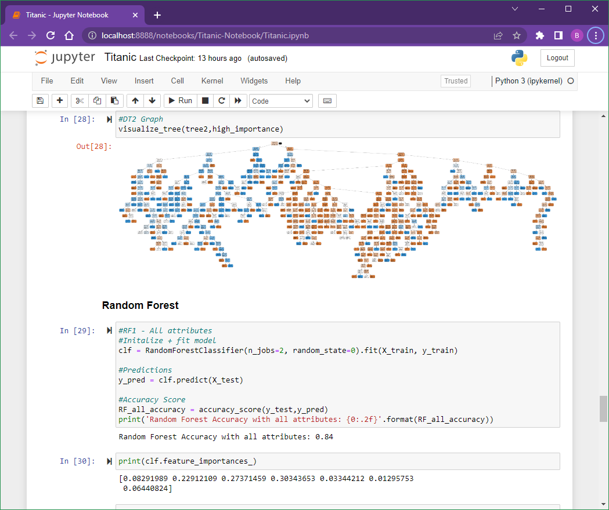
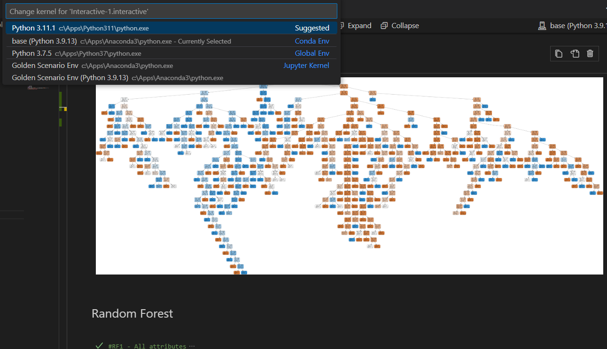

# MyDataScience

My Data Science

## Python + Jypyter Notebook + Conda

- Anaconda

- Anaconda Prompt

```dos
conda install ipykernel jupyter
cd <MyFolder>
jupyter-notebook
```



## Python + Jypyter Notebook + VSCode

Looks like it has to connect the Conda kernel.

Tried 3.7.5 and 3.11 but none of them work.



Looks like the new VSCode extension changed the UI?

## venv

venv doesn't work for this case.

```dos
python -m venv venv
venv\scripts\activate.bat
python -m pip install pandas-profiling pydotplus keras tensorflow graphviz sklearn
python Titanic.py
venv\scripts\deactivate.bat
```

## Misc

### ModuleNotFoundError: No module named 'pandas_profiling'

```dos
import sys
!{sys.executable} -m pip install pandas-profiling
```

`conda install -c conda-forge pandas-profiling=2.6.0`

### InvocationException: GraphViz's executables not found

`visualize_tree(tree,names)`

`InvocationException: GraphViz's executables not found`

```dos
conda install graphviz
conda install -c conda-forge pydotplus
```

For Win10, install Graphviz (link) and then use following command to add the path.

```python
import os
os.environ['PATH'] = os.environ['PATH'] + r";C:\Apps\Graphviz\bin"
```
